# 代码工作流程与模块作用

# Code Flow and Module Responsibilities (English)

> 本文的图、表和说明均为中英双语，函数名与文件名与源码保持一致。  
> Every diagram, table, and explanation is bilingual. Function and file names
> intentionally match the source so this document can be used as a code-reading map.

## 1. 总体架构 / Architecture at a glance

Ram 是 Linux-only 的异步文件服务器。主进程由 Tokio 驱动网络和协议状态机；可能阻塞的
短文件系统操作先经过共享、提交前准入，再进入有硬 worker 数量上限的 Tokio blocking pool。
安全设计的核心是“字符串路径只用于表达请求，已打开的文件描述符才是权限依据”。

Ram is a Linux-only asynchronous file server. Tokio drives networking and
protocol state machines. Short, potentially blocking filesystem operations pass
shared pre-submission admission before entering Tokio's worker-count-bounded
blocking pool. Its central security rule is: path strings describe requests;
opened file descriptors establish authority.

| 职责 / Responsibility | 主要文件与入口 / Main files and entry points | 作用 / Role |
|---|---|---|
| 启动与运行时 / Startup and runtime | `src/main.rs::main`, `src/lib.rs::run`, `src/runtime/mod.rs::{run,run_async,serve}` | 配置加载、监听器、运行时、信号和排空 / Config, listeners, runtime, signals, drain |
| 配置 / Configuration | `src/config/{mod,cli,schema,sources,validation,path_resolution}.rs` | 合并 CLI/env/显式 YAML/默认值，校验资源与敏感路径 / Merge CLI/env/explicit YAML/defaults and validate budgets/sensitive paths |
| 路径身份 / Path identity | `src/identity/path.rs`, `src/server/filesystem/mod.rs::RootFs` | 通过描述符和 `openat2` 固定对象 / Pin objects with descriptors and `openat2` |
| 来源身份 / Source identity | `src/identity/source.rs` | 固定内核对端，并只接受可信代理提供的严格来源细化 / Pin the kernel peer and accept strict source refinement only from trusted proxies |
| 服务状态 / Server state | `src/server/state.rs::Server::init` | 构造根能力、信号量、清理器与代理策略 / Build root capabilities, limits, cleanup, proxy policy |
| HTTP 边界 / HTTP boundary | `src/server/authentication.rs::Server::call` | 请求准入、来源身份、错误、安全头与日志 / Admission, source identity, errors, headers, logging |
| 路由 / Routing | `src/server/router.rs::Server::handle` | 规范化、认证、二次 ACL、能力计算与分派 / Normalize, authenticate, re-authorize, compute capabilities, dispatch |
| 认证授权 / Authentication and ACL | `src/auth/{mod,basic,digest,token,rate_limit,acl}.rs` | Basic, Digest, Bearer, 速率限制、撤销与分层 ACL / Basic, Digest, Bearer, limits, revocation, hierarchical ACL |
| 方法模型 / Method model | `src/http/methods.rs`, `src/server/capabilities.rs` | `Allow`/OPTIONS/405/CORS 的唯一策略源 / Single policy source for `Allow`, OPTIONS, 405, CORS |
| 请求状态与前置条件 / Request state and preconditions | `src/server/{request_context,preconditions}.rs` | 认证后的类型状态、条件头单次解析与统一求值 / Post-auth typed state, one conditional-header parse, unified evaluation |
| 读取 / Reads | `src/server/{read_routes,content,browse,archive,range,walk}.rs` | 文件、列表、遍历、搜索、Range、编辑视图与 ZIP / Files, listings, traversal, search, Range, editor views, ZIP |
| 写入 / Writes | `src/server/write_routes.rs`, `src/server/write/mod.rs` | PUT/PATCH/DELETE/MKCOL/COPY/MOVE 与原子提交 / Mutations and atomic commit |
| 列表变更版本 / Listing mutation versions | `src/server/mutation_version.rs`, `src/server/browse.rs`, `web/{ui-state,file-operations,api}.js` | 稳定扫描签名与列表来源 DELETE/MOVE 的 412 防护 / Stable-scan signing and 412 protection for listing-originated DELETE/MOVE |
| WebDAV | `src/server/dav_routes.rs`, `src/server/webdav/mod.rs` | 有界 DAV XML 与子集语义 / Bounded DAV XML and documented subset |
| 响应模型与辅助 / Response models and helpers | `src/server/{model,error,reply,security_headers}.rs` | 视图/DAV 模型、类型化错误、响应与出口安全策略 / View/DAV models, typed errors, replies, and egress security policy |
| HTTP 正文与 I/O 看门狗 / HTTP bodies and I/O watchdogs | `src/http/{body,io_watchdog}.rs` | 有界帧流、响应终态、连接与单响应进度期限 / Bounded frame streams, response outcomes, connection and per-response progress deadlines |
| 浏览器 UI / Browser UI | `web/{index,page-init,ui-state,file-operations,upload-scheduler,editor,api,app-utils,icons}.js` | 严格页面状态、上传、下载、编辑、预览与无副作用辅助 / Strict state, upload, download, edit, preview, and side-effect-free helpers |
| 日志与响应终态 / Logging and response terminal state | `src/server/mod.rs::observe_response_completion`, `src/http/body.rs`, `src/logging/{access,mod}.rs` | 真实线上字节/终态、脱敏、有界队列与轮转 / Wire bytes/outcome, redaction, bounded queue and rotation |
| 共享工具 / Shared utilities | `src/utils/mod.rs` | 时间、URI/XML 编解码、Range、TLS 与平台探测 / Time, URI/XML codecs, Range, TLS, and platform probes |
| 发布 / Release | `.github/workflows/*.yaml`, `scripts/check-*.py` | CI、模糊测试、SBOM、原生构建与资产验证 / CI, fuzzing, SBOM, native builds, asset verification |

## 2. 启动与关闭 / Startup and shutdown

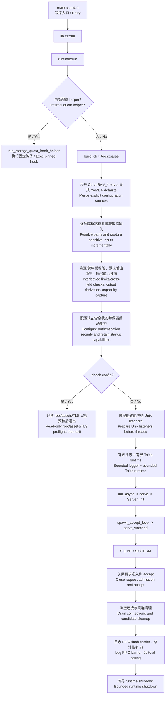

- 中文：`runtime::run` 在 clap、日志和 Tokio 初始化之前检测配额 helper 参数，helper
  会立即用固定描述符替换进程映像。这防止子进程意外继承庞大运行时状态。
- English: `runtime::run` detects the quota-helper argument before clap,
  logging, or Tokio initialization. The helper immediately replaces its image
  from a pinned descriptor, avoiding inherited runtime state.
- 中文：`Args::parse_with_config_for` 并非先完成全部字符串校验、再统一捕获路径。它在各配置项
  完成优先级合并和相对路径解析后逐项捕获敏感输入，先派生默认撤销输出，再做早期资源校验；
  随后捕获一致的输入/输出能力集、配置或校验认证安全状态，并再次校验最终资源拓扑。
- English: `Args::parse_with_config_for` does not validate every string first
  and capture paths afterward. It captures sensitive inputs incrementally once
  each setting is merged and resolved, derives the default revocation output
  before the early resource check, then captures one coherent input/output
  capability set, configures or validates authentication security, and checks
  the final resource topology again.
- 中文：Unix pathname socket 在任何辅助线程之前以私有 umask 创建；旧 socket
  只有在类型、属主和身份均符合预期时才会被清理。
- English: pathname Unix sockets are created under a private umask before
  helper threads exist; stale sockets are removed only after type, owner, and
  identity checks.
- 中文：关闭先把 `running=false` 并关闭新请求准入，再广播 accept/drain；
  已在运行的阻塞 syscall 不可强杀，所以 runtime 有最终硬截止时间。
- English: shutdown closes request admission before broadcasting accept/drain.
  Running blocking syscalls cannot be killed safely, so runtime shutdown has a
  final hard deadline.
- 中文：连接任务结束后，日志器在同一个 2 秒总 deadline 内把 flush barrier 放入有界 FIFO
  并等待专属确认。健康目的端会处理 barrier 前的记录；队列饱和或文件/控制台 I/O 卡死时
  允许丢失队尾日志，不能让日志完整性无限阻塞进程退出。
- English: after connection tasks finish, the logger gets one two-second total
  deadline to enqueue a flush barrier and await its private acknowledgement. A
  healthy destination drains preceding records; queue saturation or stuck
  file/console I/O may lose tail records rather than block process exit forever.

## 3. HTTP 请求主管线 / HTTP request pipeline

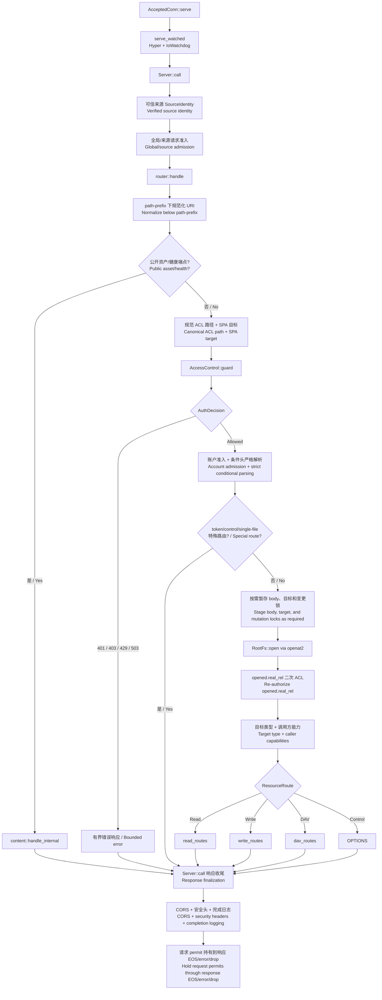

- 中文：`Server::call` 是网络与业务逻辑的包络边界。它记录请求 ID、
  验证反向代理来源、保留准入 permit，并在响应流真正结束时写入终态日志。
- English: `Server::call` is the network/business wrapper. It assigns the
  request ID, verifies proxy-derived identity, retains admission permits, and
  records terminal logs only when the body really completes, fails, or drops.
- 中文：第一次 ACL 使用规范逻辑路径；`RootFs::open` 之后使用描述符推导的
  `real_rel` 二次授权。符号链接、bind mount 别名或 rename 竞态不能跳过第二层。
- English: logical normalized paths pass the first ACL check; descriptor-derived
  `real_rel` passes the second. Symlinks, bind aliases, and rename races cannot
  substitute for descriptor authorization.
- 中文：`IndexOnly` 只能导航中间目录。描述符证明目标是文件后，
  GET/HEAD/PROPFIND/COPY 必须拒绝；不能把“可见名字”误当成“可读内容”。
- English: `IndexOnly` permits navigation through intermediate collections.
  Once the descriptor proves a file target, GET/HEAD/PROPFIND/COPY are denied;
  a visible name is not readable content.

## 4. 认证与授权 / Authentication and authorization

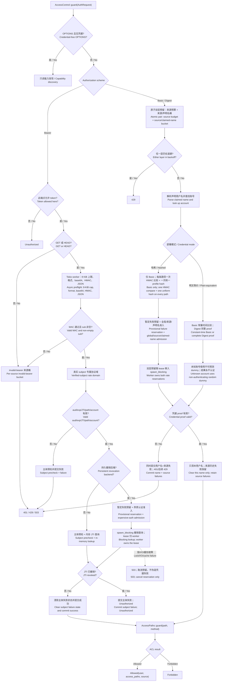

- 中文：Basic 散列密码不在 Tokio worker 上计算。暂定失败预留先封闭“并发请求都看到旧
  失败计数”的突发窗口，再由全局、来源和声明用户名三层准入限制排队与执行成本。known
  hash、known 明文与 unknown 都各执行恰好一次 HMAC 常数时间比较和一次同 profile 哈希；
  SHA-512-crypt 配置若 rounds 不一致会在启动时拒绝，Argon2id 也要求统一成本 profile。
- English: expensive Basic hashes never run on Tokio workers. A provisional
  failure reservation first closes the burst window in which concurrent requests
  could all observe stale failure counts; global, source, and claimed-name
  admission then bounds queued and active work. Known hash, known plaintext,
  and unknown accounts each execute one HMAC comparison and one identical-cost
  hash profile. Startup rejects mixed
  SHA-512-crypt rounds and non-uniform Argon2id profiles.
- 中文：密码限流保留两个互补分区：来源+声明用户名桶的派生完全不查询账号存在性，成功只
  清该用户名；跨用户名来源预算累加全部失败，任何成功登录都不能清零。这样低权账号成功
  不能清洗管理员猜测，轮换假用户名也不能取得无限免费校验。达到阈值后的 deadline 到期
  会放行恰好一个恢复尝试；正确凭据可恢复，失败才提交并安排下一段指数退避。同一 NAT 的
  跨账号失败会共享来源预算，这是限制攻击成本的有意权衡。
- English: password throttling retains two complementary partitions. The
  source+claimed-name bucket is derived without consulting account existence and
  only that name's success clears it. A cross-name source budget accumulates all
  failures and is never reset by any successful login. Low-privilege success
  therefore cannot launder administrator guesses, and fake-name rotation cannot
  obtain unlimited free checks. Once a deadline expires, exactly one recovery
  attempt is admitted: correct credentials recover, while an evaluated failure
  schedules the next exponential backoff. Cross-account failures behind one NAT
  intentionally share the source budget.
- 中文：Digest 不只校验响应值；它还把 nonce、HTTP 方法和原始 request-target
  绑定，并用有界重放缓存记录 nonce-count。含任意哈希密码的部署对所有声明用户名一致禁用
  Digest，避免 known/unknown 走不同计算路径。
- English: Digest binds nonce, method, and the original request target, then
  records nonce-count in a bounded replay cache. A deployment containing any
  password hash disables Digest uniformly for every claimed name, avoiding
  different known/unknown work paths.
- 中文：Bearer token 绑定主体、audience、路径、时间与 JTI；持久撤销文件
  在事务锁下通过已验证描述符读取和原子替换。
- English: bearer tokens bind subject, audience, path, time, and JTI. Durable
  revocation state is read and atomically replaced through verified descriptors
  while holding its transaction lock.
- 中文：Bearer payload 在 MAC 验证前完全由攻击者控制，所以未经验证的 `sub` 绝不选择
  保留状态。有效 token 只使用真实主体桶；畸形/无效 token 按已验证来源共享固定桶，不能
  通过轮换 `sub` 制造无界键。失败状态达到容量时关闭失败并返回 503，只由固定 idle expiry
  清理，绝不为新键驱逐仍保存失败次数或退避 deadline 的旧条目。
- English: a bearer payload is attacker-controlled until its MAC verifies, so
  an unverified `sub` never selects retained state. Valid tokens use only the
  verified-subject bucket; malformed/invalid tokens share one fixed bucket per
  verified source, preventing `sub` rotation from creating unbounded keys. At
  capacity, failure-state admission fails closed with 503 and only fixed idle
  expiry removes entries; a new key never evicts unexpired failures/backoff.

### 4.1 昂贵认证 worker 的所有权 / Expensive-auth worker ownership

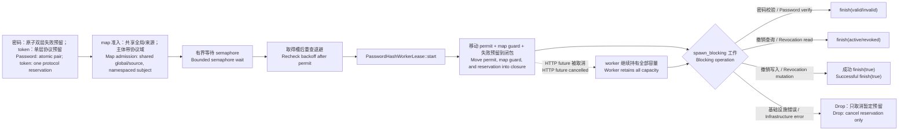

- 中文：密码的两份失败预留、semaphore permit、全局/来源/主体准入计数都移动到真正的阻塞闭包。
  客户端断开只会取消等待结果的 async future，不能提前释放槽位，也不能把已经开始计算的
  错误凭据变成“免费尝试”。密码哈希、持久撤销查询和持久撤销写入共享同一全局预算，但
  每主体计数使用互不碰撞的协议域。
- English: both password failure reservations, the semaphore permit, and
  global/source/subject admission counts move into the real blocking closure. Disconnecting a
  client cancels only the async waiter; it cannot release capacity early or turn
  an already-running bad credential into a free attempt. Password hashes,
  persistent revocation reads, and persistent revocation writes share one global
  budget while using collision-proof protocol domains for subject counts.
- 中文：持久撤销查询的锁、I/O 或缓存错误属于服务故障：返回 503 并由 Drop 取消预留，绝不
  累加凭据失败。已撤销 JTI 才提交主体失败；有效 JTI 提交成功并清除该主体旧失败。重复写入
  同一个仍有效的 JTI 是幂等操作，不增加 generation，也不替换 inode。
- English: lock, I/O, or cache errors during durable revocation lookup are
  service failures: they return 503 and Drop cancels the reservation without
  inventing a credential failure. Only a revoked JTI commits subject failure;
  an active JTI commits success. Rewriting the same still-active JTI is
  idempotent: it neither increments the generation nor replaces the inode.

### 4.2 文件系统阻塞准入与流式读取 / Filesystem blocking admission and streaming reads

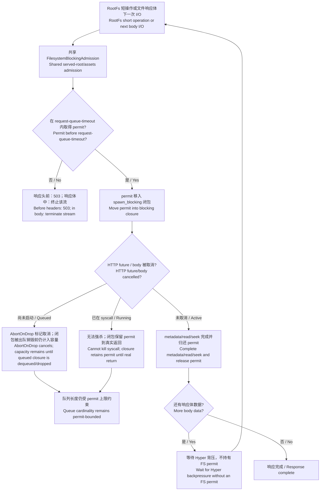

- 中文：`Server::init` 只创建一份 `FilesystemBlockingAdmission`，服务根与自定义资源根共享它。
  `RootFs::{open,open_parent,resolve_mutation_locks,entry_expectation,mkdir,rename}`、健康检查和
  symlink 授权 canonicalize 都在调用 `spawn_blocking` **之前**等待许可。Tokio 的 blocking
  worker 数量有上限，但内部提交队列本身不是容量边界；提前准入使排队与运行中的这类文件系统
  闭包总数不超过配置上限。
- English: `Server::init` creates one `FilesystemBlockingAdmission` shared by
  the served and custom-assets roots. Root opens/parent resolution/mutation-lock
  resolution/expectation/mkdir/rename, readiness checks, and symlink authorization
  canonicalization acquire before `spawn_blocking`. Tokio limits worker count,
  not submission-queue capacity; pre-admission bounds the total queued plus running
  closures in this class.
- 中文：`AbortOnDropBlocking` 防止尚未启动的已取消任务后来执行；它不能强杀已经进入内核的
  syscall。两种情况下许可都由实际排队/运行闭包拥有，不会因等待结果的 HTTP future 被丢弃而
  提前释放。准入等待在响应头发送前超时会映射为类型化 `503 Service Unavailable`。
- English: `AbortOnDropBlocking` prevents cancelled work that has not started
  from executing later; it cannot kill an in-kernel syscall. In both cases the
  real queued/running closure owns the permit, so dropping the HTTP waiter cannot
  release capacity early. Admission timeout before headers maps to a typed
  `503 Service Unavailable`.
- 中文：`GuardedBlockingFile` 不跨整个下载持有许可。每次 metadata/read/seek 独立准入，闭包
  返回即释放；Hyper 网络背压或慢客户端等待期间不占文件系统 worker 容量。响应体 Drop 会取消
  尚未取得许可的等待；若 I/O 已提交，许可仍保留到闭包真正退出。完整文件、单 Range 和 multipart
  Range 共用这套状态机。
- English: `GuardedBlockingFile` does not hold a permit for an entire download.
  Each metadata/read/seek operation is independently admitted and releases on
  closure return, so Hyper backpressure and slow clients consume no filesystem
  worker capacity while idle. Body Drop cancels a pending acquire; submitted I/O
  retains its permit until real worker exit. Full, single-range, and multipart
  range responses all use this state machine.

## 5. 读取、写入与 WebDAV / Read, write, and WebDAV

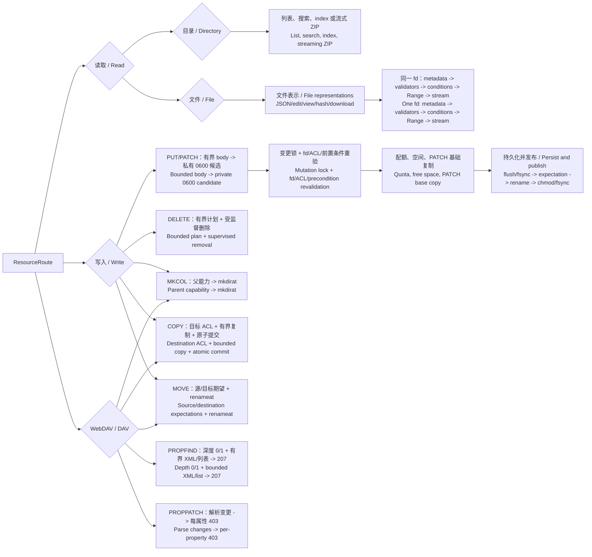

### 读取不变量 / Read invariants

1. 中文：元数据、ETag、条件请求、Range 与最终响应流来自同一个已打开 fd。  
   English: metadata, ETag, preconditions, Range, and the final stream use the same opened fd.
2. 中文：不超过 4 MiB 的文件（包括二进制文件）使用内容 SHA-256 强 ETag；更大的文件不会被
   隐式再读一遍，而使用基于稳定 metadata 的弱 ETag。是否可编辑另由大小和文本嗅探共同决定。
   English: every file up to 4 MiB, including binary files, receives a content SHA-256 strong ETag.
   Larger files are not reread implicitly and use a weak stable-metadata ETag; editability is a
   separate size-and-text-sniffing decision.
3. 中文：目录遍历同时受条目数、深度、时间、响应字节和取消限制。  
   English: traversal is bounded by entry count, depth, time, response bytes, and cancellation.
4. 中文：ZIP 使用 walker 已打开的 fd，不按 pathname 重开。每个文件实际最多向 encoder 提供
   “剩余未压缩预算 + 1 个增长探测哨兵字节”；ZIP64 判定还包含 Deflate 对不可压缩输入的
   保守膨胀上界。输入或压缩输出任一可能越过 ZIP32 时，必须在写 local header 前预声明
   ZIP64。不能只看预检 metadata/未压缩长度，否则读取增长或略低于 4 GiB 的自定义预算仍
   可能在 HTTP 200 已发出后因压缩输出越界而中止。
   English: ZIP consumes the walker's opened fd rather than reopening a pathname. A file can provide
   at most its remaining uncompressed budget plus one growth sentinel to the encoder; ZIP64 selection
   also includes a conservative Deflate expansion bound for incompressible input. If either input or
   compressed output can cross ZIP32, ZIP64 is declared before the local header. Metadata/uncompressed
   length alone would still allow growth or a sub-4-GiB custom budget to fail after HTTP 200.

### 原子写入顺序 / Atomic write order

1. 请求体先流入不可公开的 `0600` 候选文件。 / Stream the body into a private `0600` candidate.
2. 获取终局变更锁，锁身份由目录/slot/inode 能力构成。 / Acquire final locks keyed by directory, slot, and inode capabilities.
3. 在锁内重新打开并校验真实目标、ACL、ETag/日期条件和预期身份。 / Reopen and revalidate target, ACL, preconditions, and identity under the lock.
4. 执行配额 hook 与文件系统剩余空间检查。 / Run quota-hook and free-space checks.
5. 同步候选数据，重验目标预期，再用单次 rename 发布。 / Sync candidate, recheck expectation, publish with one rename.
6. 设置最终模式并同步父目录；任一持久性阶段失败都不伪装成成功。 / Set final mode and sync parent; no durability failure is reported as success.

### 目录扫描版本与危险操作 / Directory scan versions and destructive actions

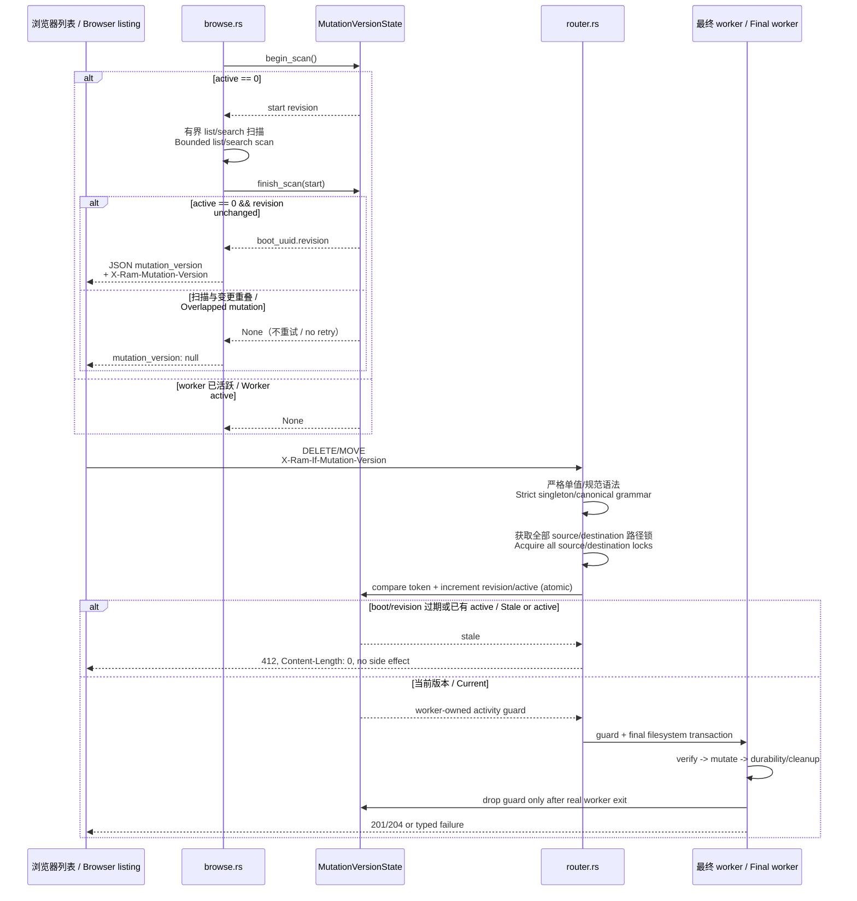

- 中文：PUT/PATCH/DELETE/MKCOL/COPY/MOVE 只要进入最终事务就保守推进 revision；随后
  失败也可以让旧列表失效。最初的 PUT/PATCH 探测锁不推进，因为网络正文尚未暂存且并未
  进入提交事务。`active` 由真正的阻塞 worker 持有，HTTP future 取消不会提前重新开放签名。
- English: PUT/PATCH/DELETE/MKCOL/COPY/MOVE conservatively advance the revision on entry to the
  final transaction; a later failure may still invalidate old listings. The initial PUT/PATCH probe
  lock does not advance it because body staging precedes the commit transaction. The real blocking
  worker owns `active`, so HTTP-future cancellation cannot reopen signing early.
- 中文：扫描只尝试一次稳定窗口，不做可能导致饥饿的重试。普通/通配符 HEAD 不扫描，因而
  不签发版本；需要具体生成表示的请求才可能获得令牌。
- English: scans attempt one stability window and never retry into starvation. Ordinary/wildcard
  HEAD does not scan and cannot receive a version; only requests that materialize the representation
  can be signed.
- 中文：这是**进程内**纪元，不监控 inotify，也不是文件系统事务 ID。只有 Ram 是服务根的
  唯一写入者时才能提供旧列表保护；其它进程、shell、同步程序或第二个 Ram 实例直接写入
  不会推进 revision。存在外部写入者时必须使用 `If-Match`、外部锁/协调或重新读取权威状态。
- English: this is a **process-local** epoch, not inotify monitoring or a filesystem transaction ID.
  It protects stale listings only when Ram is the sole writer of the served root. Direct writes by
  another process, shell, synchronizer, or second Ram instance do not advance the revision; use
  `If-Match`, external locking/coordination, or a fresh authoritative read when external writers exist.

## 6. 存储配额钩子 / Storage quota hook

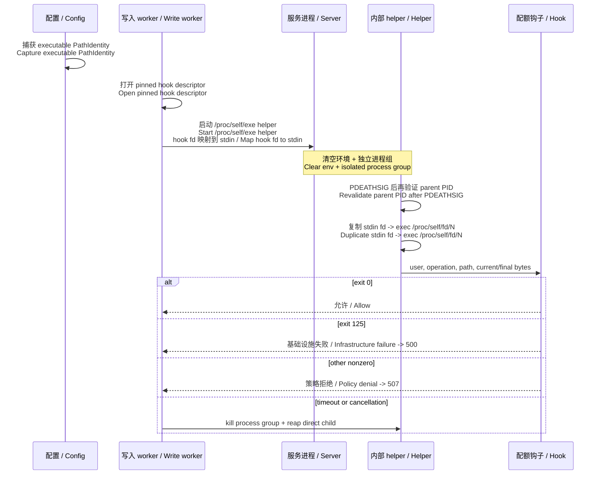

- 中文：运行时不按 pathname 重新打开 hook；启动时捕获的对象通过 fd 传递。
- English: runtime never reopens the hook by pathname; the startup-captured object travels by fd.
- 中文：helper 在设置 Linux `PDEATHSIG` 之后再比较预期父 PID，封住“检查父进程”
  与“安装死亡信号”之间的竞态。
- English: the helper checks the expected parent PID again after installing
  `PDEATHSIG`, closing the check/install race.
- 中文：超时或请求取消时，服务器向整个进程组发送信号并回收直系子进程；服务器异常死亡时，
  `PDEATHSIG` 只保证终止直接 hook，已死亡的服务器无法再主动清理整个进程组。需要覆盖这种
  崩溃场景的部署应再使用 cgroup/systemd 进程组监管；hook 不得 daemonize、double-fork 或
  `setsid` 逃离正常监督边界。
- English: timeout or request cancellation signals the whole process group and reaps the direct child.
  On abrupt server death, `PDEATHSIG` guarantees termination only of the direct hook; the dead server
  cannot then clean the complete group. Deployments requiring crash-wide descendant containment should
  additionally use cgroup/systemd supervision. Hooks must not daemonize, double-fork, or call `setsid`.

## 7. 浏览器前端 / Browser frontend

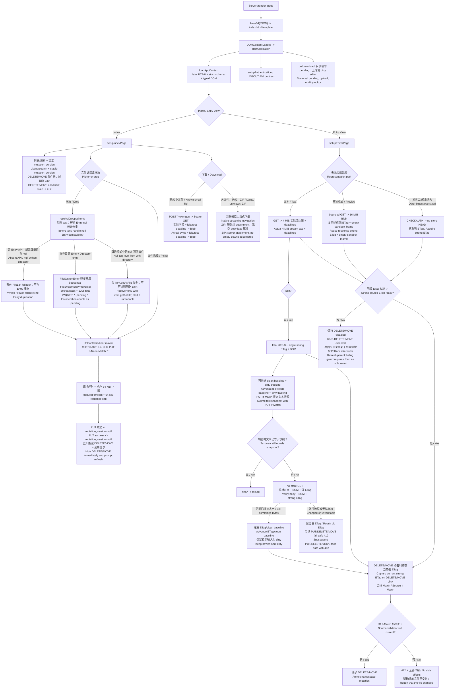

- 中文：模板状态先 Base64 还原，再用 fatal UTF-8 和完整 schema 校验。权限
  字段必须是布尔值，不会把缺失或字符串值当成 truthy 权限。
- English: template state passes Base64, fatal UTF-8, and full schema checks.
  Permission fields must be booleans; missing/string values never become
  permissive truthy state.
- 中文：前端的 `allow_*` 只控制按钮呈现；每个 HTTP 请求都必须在服务端重新
  认证、ACL 与对象身份检查。
- English: frontend `allow_*` flags only control presentation. Every request is
  independently authenticated, authorized, and descriptor-checked by the server.
- 中文：小文件 token 通道不把凭据放入 URL，但会在 JS 中缓冲，所以有
  16 MiB 实际字节上限、一个并发槽和读取截止时间。大文件和 ZIP 绕过 JS Blob。
- English: token downloads keep credentials out of URLs but buffer in JS, so
  they have a 16 MiB actual-byte limit, one active slot, and read deadlines.
  Large/unknown files and ZIP bypass JS Blob buffering.
- 中文：目录 ZIP 的响应长度由流结束决定；链接依赖服务端
  `Content-Disposition: attachment`，不再同时设置空 `download` 属性，避免 WebKit
  在未知长度响应上挂起。普通文件下载仍可使用该 HTML 提示。
- English: a directory ZIP learns its response length only when streaming ends.
  Its link relies on the server's `Content-Disposition: attachment` instead of
  also setting an empty `download` attribute, which prevents WebKit from
  stalling unknown-length responses. Ordinary file downloads retain that HTML hint.
- 中文：拖放目录的非标准 `FileSystemEntry` API 采用顺序遍历，每个 callback 最多等待
  30 秒、整次遍历最多 120 秒；枚举尚未生成 `Uploader` 时也计入 `uploadState.pending`，
  因而离页守卫不会漏掉在途目录，浏览器漏回调也不会永久挂起。拖放解析忽略 text item；
  Entry API 缺失，或没有目录且任一 file item 返回 null 时，整体回退一次 FileList。存在
  目录 Entry 时不使用完整 FileList，避免目录/文件重复或展平，只用对应 item.getAsFile()
  恢复 null 的顶层文件；仍不可读的 item 会明确提示，不会静默丢弃。任一 PUT 成功后，
  列表 `mutation_version` 会幂等置空并立即移除旧 DELETE/MOVE 控件。
- English: dropped directories traverse the non-standard `FileSystemEntry` API
  sequentially with a 30-second callback limit and 120-second total deadline.
  Enumeration counts in `uploadState.pending` before an `Uploader` exists, so
  unload protection cannot miss it and an omitted browser callback cannot hang
  forever. Drop resolution ignores text items. If the Entry API is absent—or
  any file item returns null while no directory exists—it falls back once to
  the complete FileList. With a directory Entry, it never consumes that whole
  list (which could duplicate or flatten contents); it recovers only the null
  top-level item through its own getAsFile(), and visibly reports anything
  still unreadable. Any successful PUT idempotently clears the listing mutation
  version and immediately removes stale DELETE/MOVE controls.
- 中文：编辑器只保存单个强 ETag 的 UTF-8 文件；`If-Match` 防止覆盖页面加载后的
  服务端更改。所有 Edit 页的 DELETE/MOVE 同样在点击时捕获当前强 ETag 并发送源
  `If-Match`：文本页使用有界 GET 的 ETag，内联预览复用完成读取后的 GET ETag，未读取
  正文的二进制或超大文件先经 CHECKAUTH 再用 no-store HEAD 获取 ETag。危险控件初始
  禁用；弱/缺失 ETag 或 GET/HEAD 失败时保持禁用，并明确引导用户返回父目录刷新列表。
  该 mutation-version 列表保护只在当前 Ram 是唯一写入者时成立；shell、同步任务或第二
  服务实例等外部写入者必须另行协调。处理器自身也再次拒绝空/弱 ETag，外部改写则得到
  无副作用的 412。源 `If-Match` 与目录页的 `X-Ram-If-Mutation-Version` 互斥：编辑页
  保护单个文件表示，目录页保护稳定扫描。保存期间 MOVE/DELETE 与 PUT
  互斥，但文本框仍可输入。若响应返回时出现
  较新输入，页面不会 reload；它用无缓存 GET 同时核对刚提交的规范文本、BOM 与强 ETag，
  成功时推进 clean 基线并保留新输入为 dirty；推进后的 ETag 也供下一次 DELETE/MOVE
  使用。若外部写入抢先或复核失败，则保留旧 ETag，让后续保存或源操作以 412 失败关闭，
  而不是采用用户未见过的服务端版本。
- English: the editor saves only UTF-8 files with one strong ETag, and
  `If-Match` protects the loaded server version. DELETE/MOVE on every Edit page
  also capture the current strong ETag at click time and send it as the source
  `If-Match`: text pages use their bounded GET validator, inline previews reuse
  the GET validator only after the body completes, and binary/oversized files
  without an inline body authenticate before a no-store HEAD obtains one.
  Destructive controls start disabled. A weak/missing ETag or failed GET/HEAD
  keeps them disabled and visibly directs the user to refresh the parent
  directory. That listing's mutation-version guard is valid only when this Ram
  process is the sole writer; shell tools, sync jobs, or another server require
  external write coordination. Handlers independently
  reject an empty/weak ETag, while an external rewrite produces a side-effect-
  free 412. Source `If-Match` is mutually exclusive with a listing's
  `X-Ram-If-Mutation-Version`: one protects one file representation, the other
  a stable directory scan. MOVE/DELETE are mutually excluded from an
  in-flight PUT while the textarea remains editable. If newer
  input exists when PUT completes, the page does not reload: a no-store GET
  verifies the committed canonical text, BOM, and strong ETag, advances the
  clean baseline, keeps newer input dirty, and supplies the advanced ETag to
  the next DELETE/MOVE as well. An external rewrite or failed verification
  retains the old ETag so later saves or source mutations fail closed with 412
  instead of adopting a server version the user never saw.
- 中文：预览使用 Blob 是为了避免 opaque-origin iframe 二次请求认证文件；
  空 `sandbox` 不授予脚本、同源、表单、弹窗或导航权限。
- English: Blob preview avoids a second authenticated request from an opaque
  iframe. Empty `sandbox` grants no script, same-origin, form, popup, or
  navigation capability.

## 8. 日志、响应终态与关停 / Logging, response outcome, and shutdown

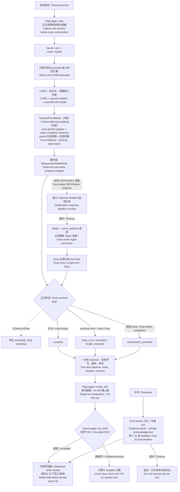

- 中文：请求侧字段在正文被消费前采集，但 `remote_user` 只能由认证成功后的响应扩展补入；
  Authorization、自报用户名、token 查询值和控制字符都不能直接成为可信审计内容。
- English: request fields are captured before body consumption, but only a
  post-authentication response extension may supply `remote_user`.
  Authorization, claimed usernames, token query values, and control characters
  never become trusted audit content directly.
- 中文：访问日志记录协议层实际产出的 DATA 字节和正文真实终态，而不是把 handler 返回成功
  当成传输成功。observer 在 EOS、错误或 Drop 三条路径恰好执行一次，请求 permit 也持有到
  该边界，避免慢客户端在响应仍传输时提前释放并发预算。
- English: access logs record DATA bytes actually yielded to the protocol layer
  and the real body outcome rather than equating handler success with delivery.
  The observer fires exactly once on EOS, error, or Drop, and request permits
  remain owned until that boundary so slow clients cannot release admission
  while their response is still in flight.
- 中文：每个非空线上正文还会在运行时套上最外层 `ResponseWriteIdleBody`。独立任务按本响应
  的非空 DATA 或 trailers 进展刷新 deadline，即使 HTTP/2 流控使 Hyper 不再轮询正文也能
  到期；超时会通知 `serve_watched` 结束整条 Hyper 连接，并 Drop 连接上所有在途正文。
  各 observer 再按自己已见的字节、producer 状态和期望长度分类终态并释放准入 permit；
  正常 EOS、producer error 或 Drop 都会停止对应 watchdog。
- English: every non-empty wire body also receives an outer
  `ResponseWriteIdleBody` at the runtime boundary. Its independent task resets
  only on that response's non-empty DATA or trailers, so it can expire even
  when HTTP/2 flow control stops Hyper from polling the body. Expiry tells
  `serve_watched` to end the entire Hyper connection and drop every in-flight
  body on it. Each observer then classifies its own terminal state from bytes,
  producer state, and expected length, releasing admission permits; normal
  EOS, producer error, or Drop stops the corresponding watchdog.
- 中文：请求任务只 `try_send` 有界日志行，不执行文件或 stderr/stdout 同步 I/O。专用线程
  通过启动时固定的父目录 fd 写入和轮转；关停 flush 使用上文同一个 2 秒总 deadline。
- English: request tasks only `try_send` bounded lines and never perform
  synchronous file or console I/O. The dedicated writer writes/rotates below a
  startup-pinned parent fd; shutdown flush uses the same two-second total
  deadline described above.

## 9. 发布验证 / Release verification

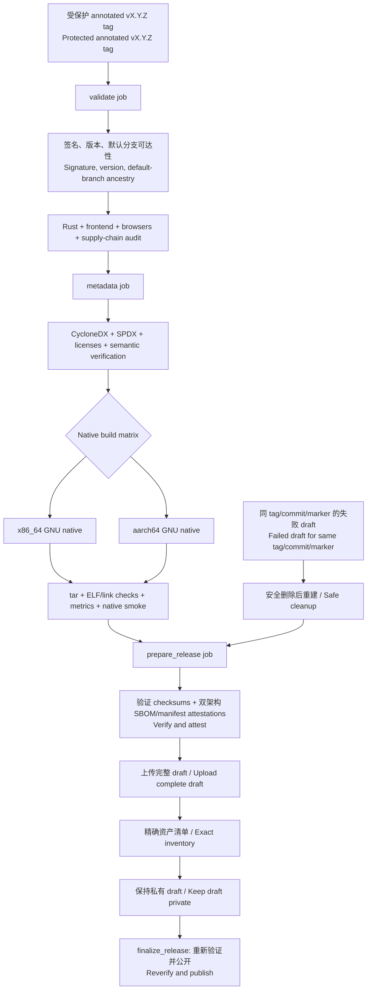

- 中文：发布不相信 tag 名字本身。工作流同时校验受保护状态、annotated
  对象、签名、直接 commit 目标、默认分支可达性与 Cargo/文档版本。
- English: release does not trust a tag name alone. It verifies protection,
  annotated type, signature, direct commit target, default-branch ancestry,
  and Cargo/document version synchronization.
- 中文：SBOM 不只检查“文件存在”；`scripts/check-sbom.py` 比较 Cargo.lock、
  Cargo metadata、CycloneDX、SPDX 与许可资料之间的语义闭包。
- English: SBOM validation is semantic, not an existence check. The checker
  reconciles Cargo.lock, Cargo metadata, CycloneDX, SPDX, and license material.
- 中文：x86-64 与 ARM64 都在对应原生 runner 上构建和烟测；draft 只有在附件
  类型、名称和数量完全符合允许列表后才发布。
- English: x86-64 and ARM64 build and smoke on matching native runners. The
  draft publishes only after exact attachment name/type/count verification.
- 中文：每个架构有独立 CycloneDX；外层 manifest 直接绑定 `ram`、CycloneDX 与
  SPDX 的 SHA-256，并与对应归档进入 attestation。Release 在独立 finalizer 重新下载制品并
  验证草稿身份、附件数量、名称、大小与 SHA-256 前始终保持私有。
- English: Each architecture has its own CycloneDX document. An outer manifest
  directly binds the SHA-256 of `ram`, CycloneDX, and SPDX and is attested with
  the matching archive. The Release remains private until an independent
  finalizer redownloads the artifacts and verifies draft identity plus every
  attachment's count, name, size, and SHA-256.

## 10. 建议阅读顺序 / Suggested reading order

1. `src/server/mod.rs` 顶部概览和 `src/server/router.rs::handle` — 先建立请求全景。 / Build the request overview first.
2. `src/auth/acl.rs` + `src/server/request_context.rs` — 理解逻辑 ACL 与 fd 二次授权。 / Understand logical ACL and fd re-authorization.
3. `src/identity/path.rs` + `src/server/filesystem/mod.rs` — 理解能力式路径安全。 / Understand capability-style path safety.
4. `src/server/write/mod.rs::{stage_upload,handle_upload}` 与 `TempFile::commit` — 跟踪原子写入。 / Trace atomic writes.
5. `src/http/body.rs` + `src/http/io_watchdog.rs` — 理解流终态、permit 生命周期和超时。 / Learn stream terminal states, permit lifetime, and timeouts.
6. `web/page-init.js` -> `web/ui-state.js` -> `web/file-operations.js` / `web/editor.js` -> `web/api.js` — 按真实启动顺序阅读前端。 / Read the frontend in actual boot order.
7. `.github/workflows/release.yaml` 配合 `scripts/check-release-*.py` 和 `scripts/check-sbom.py` — 理解供应链闭环。 / Follow the supply-chain closure.

## 11. 维护本文 / Maintaining this document

- 中文：如果新增 HTTP 方法，先更新 `src/http/methods.rs` 的中央注册表，再更新
  请求图和读/写/DAV 图；不要只改 `Allow` 文字。
- English: when adding an HTTP method, update the central method registry first,
  then the request and route diagrams; never patch only an `Allow` string.
- 中文：如果调整资源上限、超时或准入层，同时更新 README 预算表、
  `config.example.yaml`、本文对应边界与回归测试。
- English: budget, timeout, and admission changes must update the README budget
  table, example configuration, this boundary map, and regression tests.
- 中文：图中的每一个安全边界都应能映射到具体类型、函数或测试；
  无法映射的图示承诺应删除或先实现。
- English: every security boundary shown here must map to a concrete type,
  function, or test. Remove diagram promises that the implementation cannot
  substantiate.
